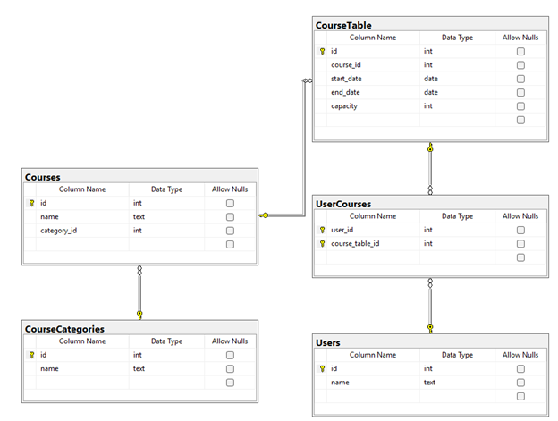

# Проф. задания для кандидатов на прикладную разработку (C#)

## 1. Проектирование базы данных

Представлено описание структуры базы данных.

### Таблица `Users`

| Поле | Тип  | Null | Ключ        | Ссылки       |
|------|------|------|-------------|--------------|
| id   | int  | Нет  | PRIMARY KEY |              |
| name | text | Нет  |             |              |

### Таблица `CourseCategories`

| Поле | Тип  | Null | Ключ        | Ссылки       |
|------|------|------|-------------|--------------|
| id   | int  | Нет  | PRIMARY KEY |              |
| name | text | Нет  |             |              |

### Таблица `Courses`

| Поле        | Тип  | Null | Ключ        | Ссылки                |
|-------------|------|------|-------------|------------------------|
| id          | int  | Нет  | PRIMARY KEY |                        |
| name        | text | Нет  |             |                        |
| category_id | int  | Нет  | FOREIGN KEY | CourseCategories(id)  |

### Таблица `CourseTable`

| Поле       | Тип  | Null | Ключ        | Ссылки       |
|------------|------|------|-------------|--------------|
| id         | int  | Нет  | PRIMARY KEY |              |
| name       | text | Нет  |             |              |
| course_id  | int  | Нет  | FOREIGN KEY | Courses(id)  |
| start_date | date | Нет  |             |              |
| end_date   | date | Нет  |             |              |
| capacity   | int  | Нет  |             |              |

### Таблица `UserCourses`

| Поле      | Тип | Null | Ключ                | Ссылки     |
|-----------|-----|------|----------------------|------------|
| course_id | int | Нет  | PRIMARY, FOREIGN KEY | Courses(id) |
| user_id   | int | Нет  | PRIMARY, FOREIGN KEY | Users(id)   |

*При наличии дополнительных требований таблицы могут быть дополнены дополнительными полями.*

## Диаграмма базы данных в среде MS SQL SERVER

## 2. Разработка интерфейса карточки сотрудника
Прототип интерфейса карточки сотрудника
> красным контуром обозначены обязательные поля, при заполнении и валидации данных контур принимает цвет по умолчанию

## 3. Разработка приложения
Проект находится в папке [EventsConsoleApp](/EventsConsoleApp)
